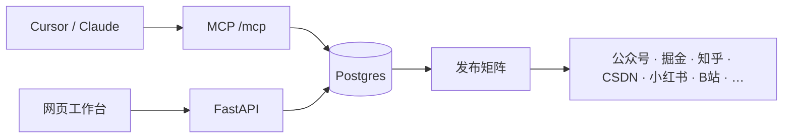

<p align="center">
  
</p>

<h1 align="center">AImagician</h1>

<p align="center">
  <strong>Agent 可操作的自媒体运营控制面。</strong><br/>
  文章、版本、选题、风格、封面、发布矩阵放进同一套 Postgres。<br/>
  Cursor、Claude 和其他 MCP 客户端读写的是这一份事实，不是一堆散落的稿。
</p>

<p align="center">
  <a href="#quick-start"></a>
  <a href="./LICENSE"></a>
  
  
</p>

<p align="center">
  <a href="https://tobemagic.github.io/computer-magician/">在线演示</a> ·
  <a href="#quick-start">快速开始</a> ·
  <a href="#capabilities">能力</a> ·
  <a href="#mcp">接入 MCP</a> ·
  <a href="#author">作者</a>
</p>

---

## 目录

- [它解决什么](#why)
- [快速开始](#quick-start)
- [能力](#capabilities)
- [接入 MCP](#mcp)
- [仓库结构](#layout)
- [配置](#config)
- [作者](#author)
- [贡献](#contributing)
- [许可证](#license)

<a id="why"></a>
## 它解决什么

多平台同步工具已经很多。缺的是一条能被 Agent 反复操作的运营链路：选题留下，正文有版本，每个平台的草稿、链接和失败原因都记在同一篇文章上。



你的账号、cookie、浏览器 profile 留在自己机器上。仓库里只有基建。

<a id="quick-start"></a>
## 快速开始

需要 Python 3.11+、Node.js、本机 PostgreSQL。

```bash
createdb aimagician
cd backend
python3 -m venv .venv && . .venv/bin/activate
python -m pip install -e ".[dev]"
cp .env.example .env
alembic upgrade head
AIMAGICIAN_ADMIN_PASSWORD='change-me' python -m app.cli bootstrap-admin \
  --email admin@example.com --display-name Admin --password "$AIMAGICIAN_ADMIN_PASSWORD"
python -m uvicorn app.main:create_app --factory --host 127.0.0.1 --port 8765
```

另开一个终端：

```bash
cd frontend
npm install
npm run dev
```

打开 `http://127.0.0.1:3000`，用上面的管理员账号登录。健康检查：

```bash
curl -s http://127.0.0.1:8765/api/health
```

静态演示（不连数据库，只能点界面）在 GitHub Pages：<https://tobemagic.github.io/computer-magician/>。文章、MCP 和发布要按上面的命令在自己的机器上跑。

<a id="capabilities"></a>
## 能力

| 面 | 你可以做什么 |
|---|---|
| 文章 | 创建、检索、归档，正文多版本，diff，设当前版本 |
| 系列 | 专栏目录，取下一篇，回写进度 |
| 选题 | 热点候选入库，采纳后变成文章 |
| 风格 | `docs/prompts/` 里的工程师长文、标题、小红书第一人称 |
| 封面与卡片 | 封面流程、黛墨描金 HTML 卡片 |
| 发布矩阵 | 每个平台一条状态：草稿、已发、链接、失败原因 |
| 平台适配 | 公众号、掘金、知乎、CSDN、51CTO、B站专栏、InfoQ、小红书 |
| 审计 | 质量发现、运行、任务、事件，MCP 调用有日志 |

平台登录和真发文章要你自己的会话。公开仓库不带任何登录态。

<a id="mcp"></a>
## 接入 MCP

服务挂在 `http://127.0.0.1:8765/mcp`，用 Bearer agent token。

```json
{
  "mcpServers": {
    "aimagician": {
      "url": "http://127.0.0.1:8765/mcp",
      "headers": {
        "Authorization": "Bearer <agent-access-token>"
      }
    }
  }
}
```

Agent 先看能力，再动文章：

```text
aimagician_capabilities
aimagician_search_articles
aimagician_get_article_body
aimagician_update_article_body
aimagician_get_publication_matrix
aimagician_update_publication
```

写作、封面、全网草稿、日报批次、prompt 读写也在同一组工具里。网页上的「MCP 运维控制台」能看到调用记录。

<a id="layout"></a>
## 仓库结构

```text
.
├── backend/             FastAPI、Postgres、Alembic、MCP
├── frontend/            运营工作台
├── publisher-worker/    发布任务渲染
├── browser-runners/     各平台浏览器适配器，不含登录态
├── card-render/         卡片皮肤
├── docs/prompts/        可直接改的风格包
├── assets/fonts/        Noto Sans SC，SIL OFL
└── assets/reaction-library/   反应图 manifest，图文件自行挂载
```

<a id="config"></a>
## 配置

复制 `backend/.env.example`。至少改这三项：

| 变量 | 作用 |
|---|---|
| `AIMAGICIAN_DATABASE_URL` | Postgres 连接串 |
| `AIMAGICIAN_SESSION_SECRET` | 至少 32 字符 |
| `AIMAGICIAN_ADMIN_PASSWORD` | 首个管理员密码，用环境变量传入 |

品牌和公众号不要写进代码，写进环境：

| 变量 | 作用 |
|---|---|
| `AIMAGICIAN_BRAND_NAME` | 封面水印、卡片署名，默认「计算机魔术师」 |
| `AIMAGICIAN_WECHAT_ACCOUNT_NAME` | 文末公众号名 |
| `AIMAGICIAN_WECHAT_PROFILE_ID` | 关注卡片用的 profile id |
| `AIMAGICIAN_WECHAT_BIZ` | 公众号主页 biz |
| `AIMAGICIAN_HEXO_BASE_URL` | 博客归档根地址 |
| `AIMAGICIAN_HEXO_REPO_DIR` | Hexo 仓库目录 |

模型密钥、Notion token、平台 cookie 只放本机 `.env`。`.env` 已在 `.gitignore` 里。

<a id="author"></a>
## 作者

<p align="center">
  <strong>计算机魔术师</strong><br/>
  全栈工程师。这套基建是我写技术号时自己在用的控制面：选题、成稿、审校、多平台分发走同一篇文章库。
</p>

<p align="center">
  掘金人工智能作者榜第一<br/>
  华为云云享专家 · 阿里云乘风者计划专家博主 · 腾讯云创作之星
</p>

<p align="center">
  <a href="https://juejin.cn/user/3294573386554446/posts">掘金</a> ·
  <a href="https://cpt-magician.blog.csdn.net/">CSDN</a> ·
  <a href="https://tobemagic.github.io/ai-magician-blog/">博客</a> ·
  <a href="https://cloud.tencent.com/developer/user/9709733">腾讯云开发者社区</a> ·
  <a href="https://blog.51cto.com/u_15691039">51CTO</a>
</p>

<p align="center">公众号「计算机魔术师」</p>

<a id="contributing"></a>
## 贡献

```bash
cd backend && . .venv/bin/activate && python -m pytest
cd frontend && npx tsc --noEmit
```

改风格包直接编辑 `docs/prompts/`。新平台适配器放在 `browser-runners/`，不要提交 `credentials/` 或浏览器 profile。

<a id="license"></a>
## 许可证

代码使用 [Apache-2.0](./LICENSE)。

`assets/fonts/NotoSansSC-Regular.ttf` 使用 [SIL Open Font License 1.1](./assets/fonts/OFL.txt)。反应图的二进制素材没有放进仓库，manifest 只描述插槽；你自己挂载图库时请核对每张图的许可证。
